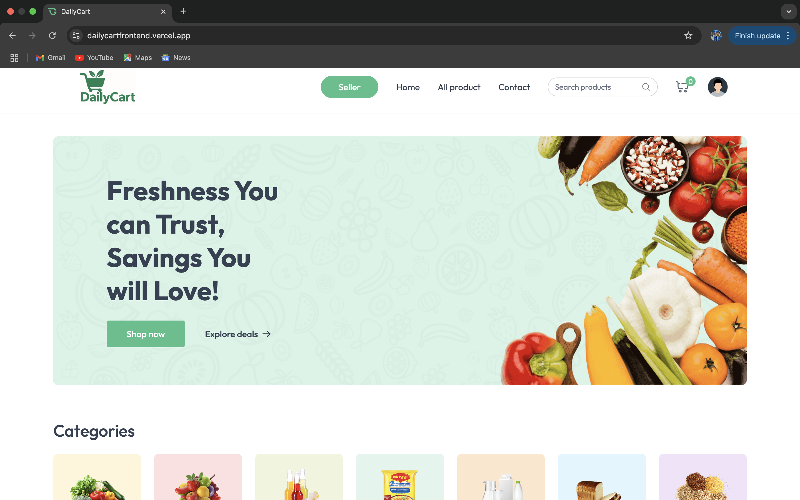

# 🛒 DailyCart

**DailyCart** is a full-featured, responsive, and dynamic e-commerce platform built with the **MERN stack** (MongoDB, Express, React, Node.js). It provides users with a seamless shopping experience, while giving admins powerful tools to manage products, users, and orders.

🌐 **Live Demo:** [https://dailycartfrontend.vercel.app/](https://dailycartfrontend.vercel.app/)

 

---

## 🚀 Features

### 👥 User Functionality
- User registration and authentication (JWT-based)
- Secure login/logout with role-based access
- Profile management and order history

### 🛍️ Shopping Experience
- Product listing, detailed views, and search/filter capabilities
- Add to cart, edit quantity, and remove items
- Checkout process with payment integration (e.g., Stripe/PayPal)
- Order placement with confirmation and tracking

### 🛠️ Admin Panel
- Dashboard for managing orders, products, and users
- Create, update, and delete products
- View and update order status
- Role-based authorization to restrict access

### 📱 Responsive Design
- Fully responsive UI for mobile, tablet, and desktop devices
- Built with modern UI/UX best practices

---

## 🧰 Tech Stack

| Frontend | Backend | Database | Authentication | Other |
|----------|---------|----------|----------------|-------|
| React.js | Node.js | MongoDB  | JWT, Bcrypt     | Redux, Axios, Express, Mongoose, Stripe |

---

